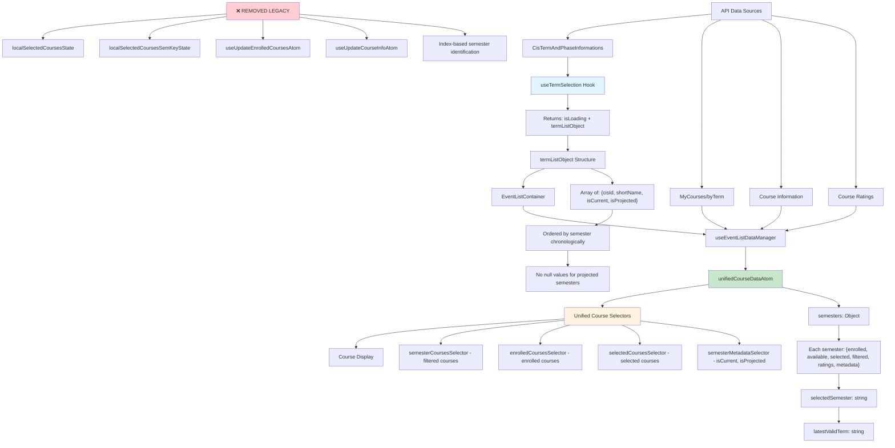

# Simplified Course Data Flow Documentation

## Overview

This document outlines the **new simplified course data flow** that removes legacy scattered atom states and centralizes all course data management through the unified course data system.

## Architecture Diagram



## Data Flow Steps

### 1. Term Selection & Initialization

```javascript
// useTermSelection.js - SIMPLIFIED
export function useTermSelection() {
  return {
    isLoading: boolean,
    termListObject: [
      {
        cisId: "12345",
        shortName: "HS24",
        isCurrent: true,
        isProjected: false,
      },
      {
        cisId: "67890",
        shortName: "FS25",
        isCurrent: false,
        isProjected: true, // Future semester
      },
    ],
  };
}
```

### 2. Event List Container - Simplified Interface

```javascript
// EventListContainer.jsx - NEW
<EventListContainer
  termListObject={termListObject}
  selectedSemesterShortName="HS24"
/>
```

### 3. Unified Data Management

```javascript
// useEventListDataManager.js - SIMPLIFIED
export const useEventListDataManager = ({ authToken, selectedSemester }) => {
  // Only updates unifiedCourseDataAtom
  // No more scattered legacy atoms
  return { isLoading };
};
```

### 4. Course Display via Selectors

```javascript
// In EventListContainer
const filteredCourses = useRecoilValue(
  semesterCoursesSelector({
    semester: selectedSemesterShortName,
    type: "filtered",
  })
);
```

## Key Improvements

### ✅ **Simplified Data Structure**

- **Single Source of Truth**: `unifiedCourseDataAtom` contains all course data
- **Semantic Identification**: Semesters identified by `shortName` (e.g., "HS24") instead of numeric indices
- **Consistent Metadata**: Each semester has `isCurrent`, `isProjected`, `isFutureSemester`, etc.

### ✅ **Removed Legacy Dependencies**

```javascript
// ❌ REMOVED
import { localSelectedCoursesState } from "./localSelectedCoursesAtom";
import { localSelectedCoursesSemKeyState } from "./localSelectedCoursesSemKeyAtom";
import { useUpdateEnrolledCoursesAtom } from "./useUpdateEnrolledCourses";
import { useUpdateCourseInfoAtom } from "./useUpdateCourseInfo";

// ✅ REPLACED WITH
import { useUnifiedCourseData } from "./useUnifiedCourseData";
import { semesterCoursesSelector } from "../recoil/unifiedCourseDataSelectors";
```

### ✅ **Simplified Component Props**

```javascript
// ❌ OLD COMPLEX PROP
selectedSemesterState: {
  cisId: "12345",
  index: 1,
  shortName: "HS24",
  isFutureSemester: false,
  referenceSemester: null,
  // ... many more scattered properties
}

// ✅ NEW SIMPLE PROPS
termListObject: [{cisId, shortName, isCurrent, isProjected}]
selectedSemesterShortName: "HS24"
```

### ✅ **Projected Semesters Support**

- **No More Null Values**: Projected future semesters have proper structure
- **Clear Identification**: `isProjected: true` for future semesters
- **Reference Handling**: Automatic determination of reference semesters for projections

## Unified Course Data Structure

```javascript
unifiedCourseDataState = {
  semesters: {
    HS24: {
      enrolled: [], // User's enrolled courses
      available: [], // All available courses
      selected: [], // User's selected/wishlisted courses
      filtered: [], // Filtered courses for display
      ratings: {}, // Course ratings map
      lastFetched: "2024-01-01T12:00:00Z",

      // Metadata
      isFutureSemester: false,
      referenceSemester: null,
      cisId: "12345",
      isCurrent: true, // ✅ NEW: API-marked current semester
      isProjected: false, // ✅ NEW: Whether this is a projected future semester
    },
    FS25: {
      // ... same structure
      isCurrent: false,
      isProjected: true, // ✅ Future semester with proper support
    },
  },
  selectedSemester: "HS24", // Currently selected semester
  latestValidTerm: "HS24", // Latest term with actual course data
};
```

## Migration Benefits

### 🚀 **Performance Improvements**

- **Reduced State Updates**: Single atom instead of multiple scattered atoms
- **Efficient Selectors**: Direct access to filtered data without intermediate processing
- **Minimal Re-renders**: Only components using specific selectors re-render

### 🧹 **Code Simplification**

- **Fewer Dependencies**: Removed 4+ legacy hooks and atoms
- **Clearer Data Flow**: Single path from API → Unified Data → Selectors → Display
- **Better Maintainability**: All course data logic centralized in `useUnifiedCourseData`

### 🔧 **Developer Experience**

- **Type Safety**: Clear interfaces for `termListObject` and semester metadata
- **Debugging**: All course data visible in single atom in React DevTools
- **Testing**: Easier to mock and test unified data structure

## Usage Examples

### Getting Filtered Courses

```javascript
const filteredCourses = useRecoilValue(
  semesterCoursesSelector({
    semester: "HS24",
    type: "filtered",
  })
);
```

### Getting Semester Metadata

```javascript
const metadata = useRecoilValue(semesterMetadataSelector("HS24"));
// Returns: {isCurrent, isProjected, isFutureSemester, referenceSemester, cisId}
```

### Updating Course Data

```javascript
const { updateAvailableCourses, updateFilteredCourses } =
  useUnifiedCourseData();

// Update available courses for a semester
updateAvailableCourses("HS24", courseData);

// Update filtered courses based on current filter options
updateFilteredCourses("HS24", filterOptions, selectedCourseIds);
```

## Future Considerations

### 📋 **Next Steps**

1. **Complete Migration**: Remove all remaining legacy atom references
2. **Performance Optimization**: Implement selector memoization for large course lists
3. **Error Handling**: Add unified error handling for course data operations
4. **Caching Strategy**: Implement smart caching based on `lastFetched` timestamps

### 🔮 **Potential Enhancements**

- **Offline Support**: Cache course data for offline browsing
- **Background Sync**: Automatically refresh stale course data
- **Conflict Resolution**: Handle concurrent updates to selected courses
- **Analytics Integration**: Track course selection patterns through unified data
